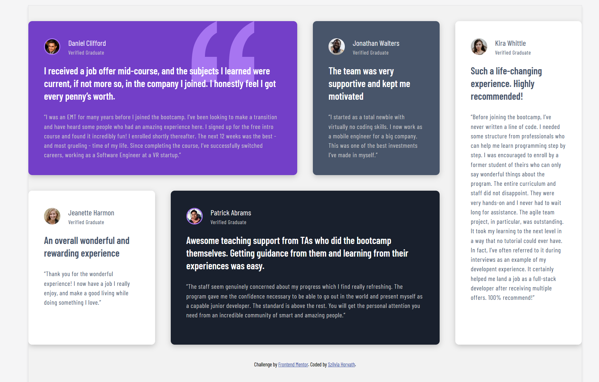

# Frontend Mentor - Testimonials grid section solution

This is a solution to the [Testimonials grid section challenge on Frontend Mentor](https://www.frontendmentor.io/challenges/testimonials-grid-section-Nnw6J7Un7). Frontend Mentor challenges help you improve your coding skills by building realistic projects. 

## Table of contents

- [Overview](#overview)
  - [Screenshot](#screenshot)
  - [Links](#links)
- [My process](#my-process)
  - [Built with](#built-with)
  - [What I learned](#what-i-learned)
  - [Continued development](#continued-development)
- [Author](#author)

**Note: Delete this note and update the table of contents based on what sections you keep.**

## Overview

### The challenge

Users should be able to:

- View the optimal layout for the site depending on their device's screen size

### Screenshot

desktop view 
mobile view [mobile view](./images/screenshot-mobile.png)

### Links

- Solution URL: [github](https://github.com/hszilvi/testimonals-grid-section)
- Live Site URL: [live url](https://hszilvi.github.io/testimonals-grid-section/)

## My process

### Built with

- Semantic HTML5 markup
- CSS custom properties
- Flexbox
- CSS Grid
- Mobile-first workflow

### What I learned

I became more confident using grid and flex box. 

### Continued development

- I still need to learn more about SEO aspects,
- need to start using git branches to improve my github knowledge, 
- need to practise more CSS/Sass,
- use media queries.

## Author

- Frontend Mentor - [@hszilvi](https://www.frontendmentor.io/profile/hszilvi)

